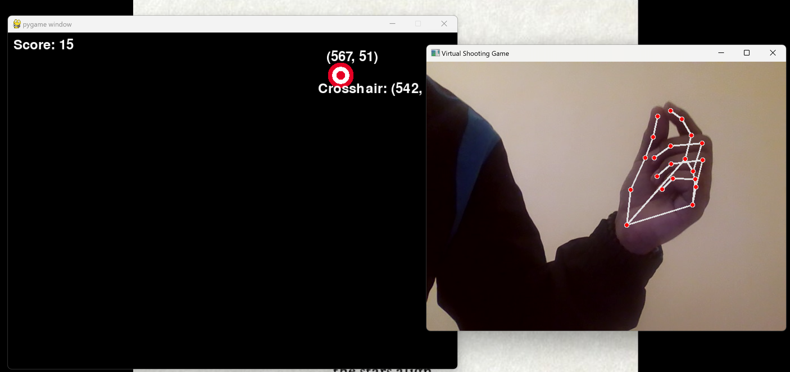

# 🎯 Virtual Shooting Game

Welcome to the Virtual Shooting Game! This game utilizes your webcam and hand gestures to simulate a shooting experience. Use your hand to aim and shoot targets on the screen, all while enjoying a dynamic and engaging gameplay experience.

 

## Features
- 📷 **Webcam Integration**: Utilizes Mediapipe to detect hand gestures and track movements.
- 🎮 **Real-time Shooting**: Aim and shoot targets using your hand gestures.
- 💻 **Interactive UI**: See your score and target coordinates directly on the screen.
- 🔊 **Sound Effects**: Hear realistic shooting sounds when you hit a target.

## Requirements
- Python 3.x
- Pygame
- OpenCV
- Mediapipe
- Other dependencies listed in `requirements.txt`

## Installation
Clone the repository:

```bash
git clone https://github.com/EchoSingh/VirtualShootingGame.git
```

Navigate to the project directory:

```bash
cd VirtualShootingGame
```

Install dependencies:

```bash
pip install -r requirements.txt
```

Run the game:

```bash
python src/main.py
```

## How to Play
1. **Start the game**: Run `src/main.py` to launch the game.
2. **Aim**: Position your hand in front of the webcam to move the crosshair.
3. **Shoot**: Pinch your thumb and index finger together to shoot at the targets.
4. **Score**: Hit targets to score points. Your score is displayed on the screen.


## Contributing
Feel free to fork the repository and submit pull requests. For major changes, please open an issue first to discuss what you would like to change.

## License
This project is licensed under the MIT License - see the [LICENSE](LICENSE) file for details.

## Contact
For any questions or suggestions, please reach out to me at EchoSingh.

## Folder Structure
```
VirtualShootingGame/
│
├── assets/
│   ├── crosshair.png
│   ├── target.png
│   ├── sounds/
│   │   ├── shoot.wav
│
├── src/
│   ├── main.py
│
├── README.md
├── requirements.txt
└── .gitignore
```
